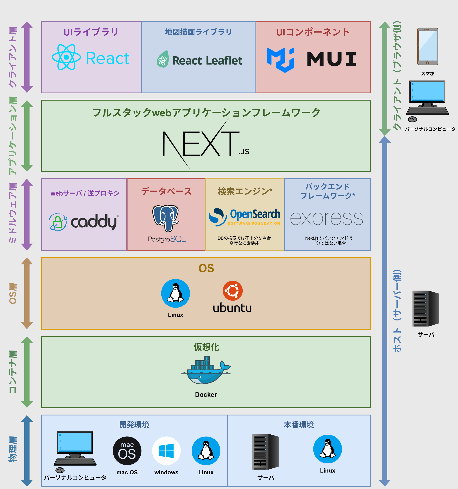

# ict-solutions-project

「まいぞーん」: 地図型 SNS × イベント共有プラットフォーム。

## 🚀 クイックスタート

```powershell
git clone <REPO_URL>
docker compose up -d --build
```

アクセス:

- http://localhost:3000 (Next.js dev サーバ)
- https://localhost (Caddy 経由)

##  アーキテクチャ環境図



## 📄 詳細ドキュメント

- プロジェクト概要: `docs/プロジェクト内容.md`
- 採用技術: `docs/採用技術.md`
- 環境構築: `docs/環境構築手順.md`
- コントリビューションガイド: `docs/CONTRIBUTING.md`
- アーキテクチャ環境図: `docs\アーキテクチャ環境図.drawio`
